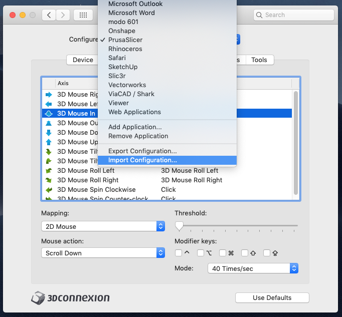

# PrusaSlicer-3DC

Config file for 3DConnexion Space Mouse for use with PrusaSlicer.

This is a work-in-progress. It customizes the Axes and Buttons of the 3DConnexion SpaceMouse for use with PrusaSlicer. This has had very minimal testing on a Mac running Mojave and PrusaSlicer Version: 2.0.0+ (Build: PrusaSlicer-2.0.0+-201905201652) as of 2019-06-30.

### Prerequisites

- 3DConnexion Space Mouse
- PrusaSlicer 

### Installation

1. Clone / Download the repo

2. From the 3DConnexion control panel, select "Import Configuration…"

   

3. Navigate to the files you just downloaded and select "3Dconnexion Config.3dc"

4. You *may* have to restart PrusaSlicer if it was already running.

### Usage

* This configuration has the "Dominant" checkbox enabled, so it will react only to the axis with the largest displacement (the dominant direction of movement)
* The  left and right buttons are mapped to Command-5 and Command-6 respectively. This allows you to toggle quickly between 3D view and Preview modes.
* Pushing the mouse left will move the view to the left
* Pushing the mouse right will move the view to the right
* Spinning the wheel clockwise will cause rotate the view counterclockwise
* Spinning the wheel counterclockwise will cause rotate the view clockwise
* Pushing the mouse forward (away from you) will move the view away from you (zoom out)
* Pulling the mouse backward (towards you) will move the view toward you (zoom in)
* Tilting the mouse forward will tilt the view forward
* Tilting the mouse backward will tilt the view backward